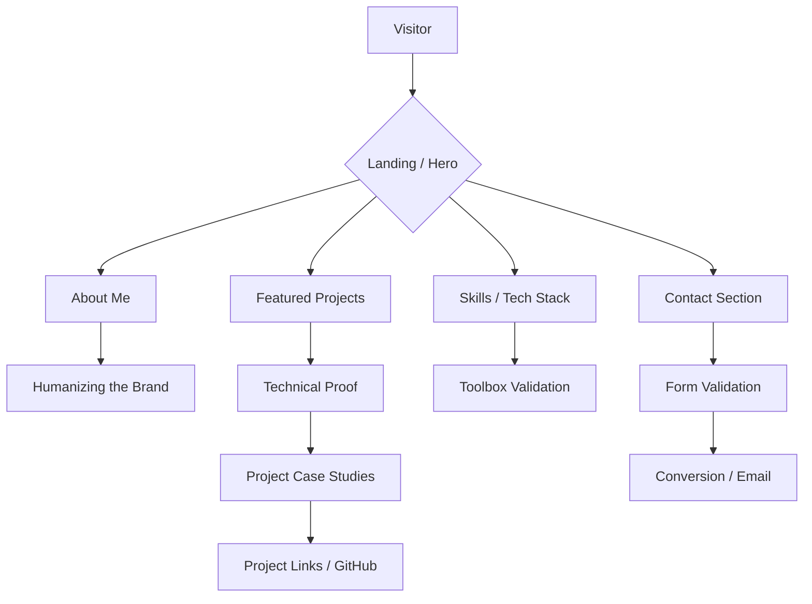
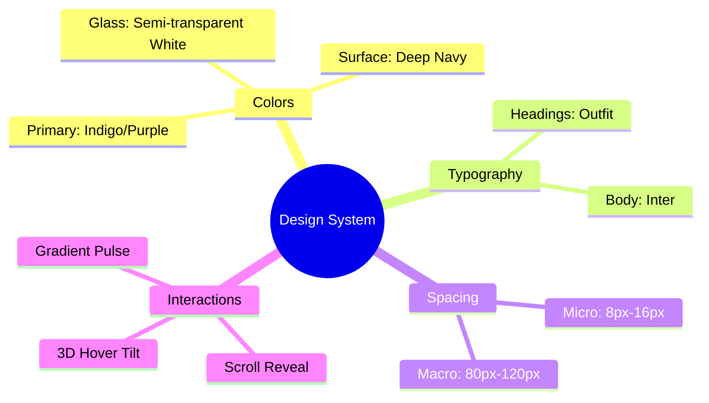

# 🚀 Production-Level Personal Portfolio

A premium, high-performance personal portfolio website built with a focus on client trust, technical authority, and modern UI/UX aesthetics. This project showcases a full-stack developer's expertise through sophisticated animations, semantic architecture, and real-world project integration.

---

## 💎 Key Features

- **Modern Aesthetic**: Glassmorphism, 3D tilt effects, and smooth scroll animations.
- **Client-Centric Psychology**: Structure designed to build trust and lead visitors toward conversion.
- **Responsive Architecture**: Mobile-first design that scales perfectly to 4K displays.
- **Performance Optimized**: Vanilla JS and CSS for lightning-fast load times and zero dependency bloat.
- **SEO & Accessibility**: Semantic HTML5 with ARIA roles and meta-tag optimization.

---

## 🛠️ Technology Stack

- **Frontend**: HTML5, Vanilla CSS3 (Custom Design System), Modern JavaScript (ES6+).
- **Design Philosophy**: Glassmorphism, Macro-spacing, and Micro-interactions.
- **Animations**: Intersection Observer API & CSS Keyframes.
- **Assets**: High-quality project previews and integrated GitHub social proof.

---

## 📐 System Architecture

The following diagram illustrates the component architecture and the flow of user interaction within the portfolio:



---

## 📦 Featured Projects

| Project | Description | Tech Stack |
| :--- | :--- | :--- |
| **AdFlow Pro AI** | AI-powered advertising optimization platform. | TypeScript, Python, AI/ML |
| **AI E-commerce Advisor** | Market analyzer & automated store generator. | AI, Full-Stack |
| **CryptoVault Pro** | Secure cryptocurrency wallet with biometric security. | TypeScript, Solidity |
| **EduSync System** | Real-world school management & CRUD platform. | TypeScript, MySQL |
| **Elite Sneaker Store** | Modern high-end e-commerce interface. | HTML, CSS |
| **GitHub Clone** | Pixel-perfect recreation of the GitHub UI. | HTML, CSS |

---

## 🚀 Deployment & Setup

### Local Setup
1. Clone the repository:
   ```bash
   git clone https://github.com/Arslan-web-Dev/-DecodeLabs-Internship_projects.git
   ```
2. Navigate to the directory:
   ```bash
   cd -DecodeLabs-Internship_projects
   ```
3. Open `index.html` in your browser or use a Live Server.

### Hosting
This project is optimized for deployment on **GitHub Pages**, **Vercel**, or **Netlify**. Simply connect the repository to your preferred hosting platform for automatic deployment.

---

## 🎨 UI/UX Design System



---

## 🔍 Code Quality & Review

The project follows strict architectural guidelines:
- **Zero Frameworks**: Pure vanilla implementation for maximum control.
- **Modular CSS**: BEM-inspired naming convention.
- **Performance**: Intersection Observer for lazy-loading animations.

---

## 📬 Contact

**Muhammad Arslan**  
*Full Stack Architect & AI Specialist*  

- **LinkedIn**: [Arslan-web-Dev](https://linkedin.com/)
- **GitHub**: [@Arslan-web-Dev](https://github.com/Arslan-web-Dev)
- **Email**: arslan@example.com

---
*Created as part of the DecodeLabs Internship Projects.*
